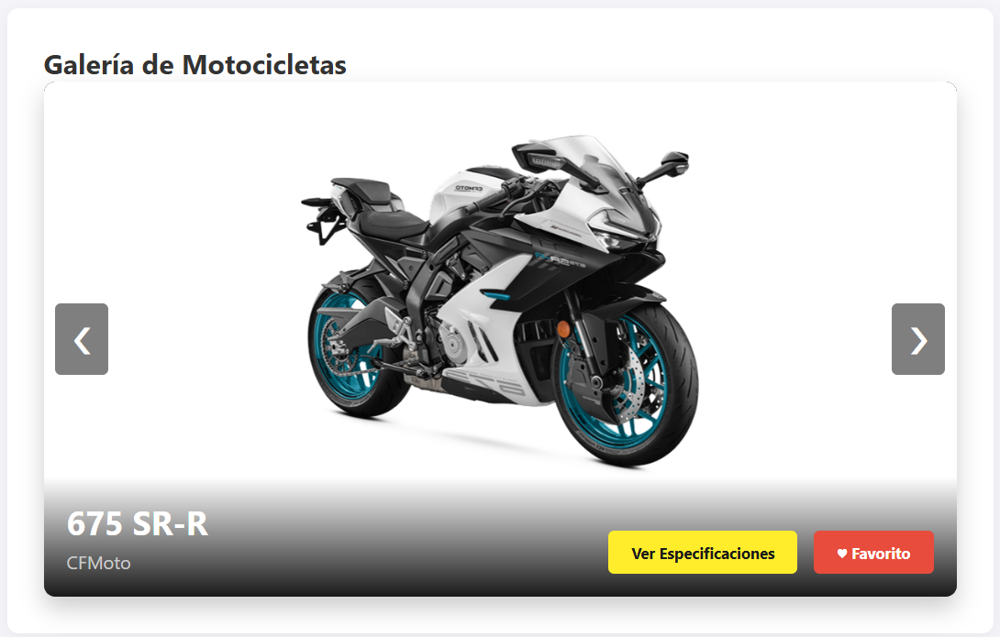
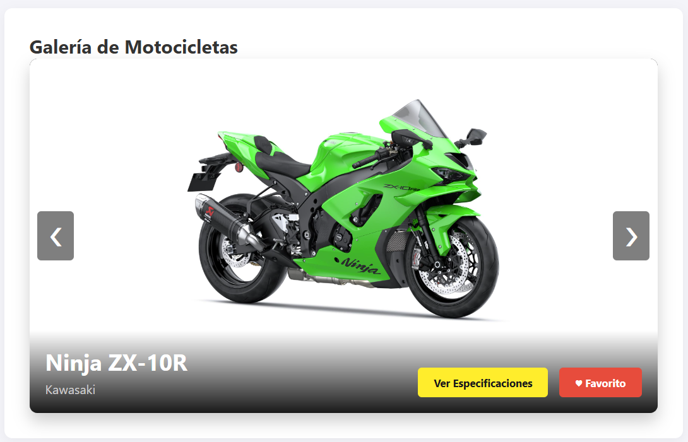
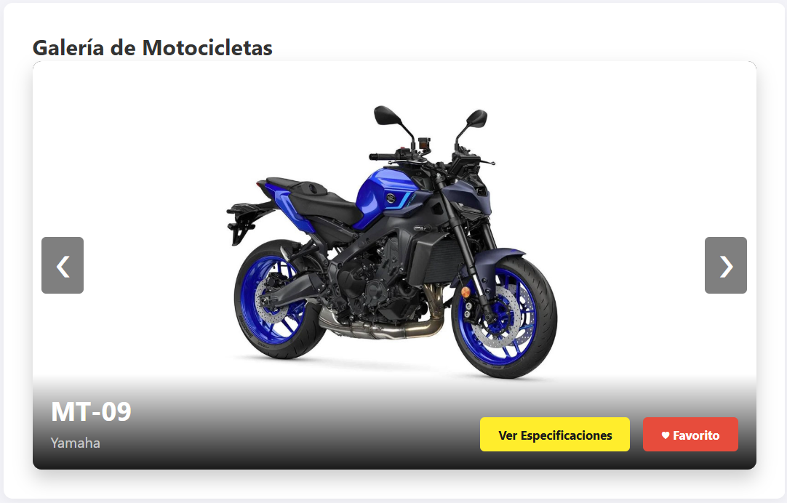
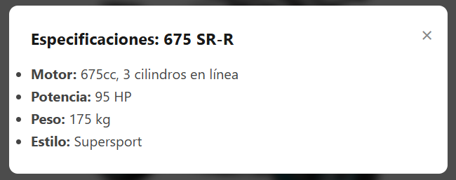
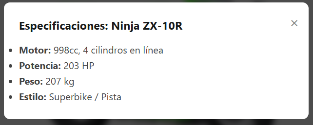
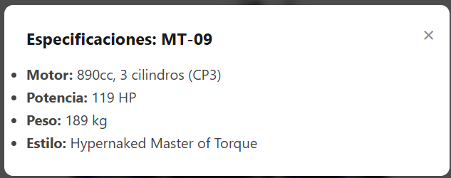
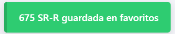

# INSTITUTO TECNOLÓGICO NACIONAL DE MÉXICO
## INSTITUTO TECNOLÓGICO DE OAXACA

**Carrera:** Ingeniería en Sistemas Computacionales
**Materia:** Programación Web
**Unidad:** Unidad 2 - Componentes Visuales con JS
**Docente:** Adelina Martínez Nieto
**Alumno:** Aleks Jesús Aquino Rosales
**Hora:** 10:00-11:00 a.m.

---

# Aleks UI — Librería de Componentes Visuales Interactivos

## ¿Qué problema resuelve?

En el desarrollo web actual, implementar interfaces dinámicas suele requerir la instalación de frameworks pesados como React o Vue, o depender de librerías de terceros difíciles de personalizar. **Aleks UI** resuelve este problema al ofrecer una colección de componentes visuales (Modales, Toasts y Sliders) construidos **100% con Vanilla JavaScript**.

Su arquitectura permite generar elementos visuales dinámicamente desde JavaScript sin necesidad de escribir código HTML repetitivo, garantizando que los componentes sean ligeros, completamente reutilizables y fáciles de inyectar con datos variables.

---

## 🚀 Instalación y Configuración

Para utilizar Aleks UI en cualquier proyecto, solo necesitas enlazar los archivos base en tu documento HTML. No requiere NPM ni gestores de paquetes.

1. Agrega los estilos en el `<head>`:

```html
<link rel="stylesheet" href="css/aleks-ui.css">
```

2. Agrega la librería justo antes de cerrar el `<body>`:

```html
<script src="js/aleks-ui.js"></script>
```

---

## 🛠️ Uso y Ejemplos de Código

A continuación se muestra cómo instanciar y reutilizar cada componente visual mediante parámetros dinámicos.

### 1. Sistema de Notificaciones (Toasts)

Genera alertas temporales que no interrumpen la navegación del usuario. Desaparecen automáticamente gracias a sus funciones asíncronas (`setTimeout`).

```javascript
// Mostrar una notificación de éxito
AleksUI.mostrarToast('Vehículo agregado a favoritos', 'success');

// Mostrar una alerta de error (dura 5 segundos)
AleksUI.mostrarToast('Error al conectar con el servidor', 'error', 5000);

// Mostrar un aviso informativo
AleksUI.mostrarToast('Actualizando catálogo...', 'info');
```

### 2. Ventana Modal Dinámica

Crea una ventana emergente superpuesta. El HTML interno del modal es inyectado desde JavaScript, lo que permite pasarle cualquier cadena de texto o estructura HTML como especificaciones técnicas, formularios o imágenes.

```javascript
// Llamada básica al modal
const titulo = "TVS Ronin - Especificaciones";
const especificaciones = `
    <ul>
        <li><strong>Motor:</strong> 225.9cc, monocilíndrico SOHC</li>
        <li><strong>Potencia:</strong> 20.4 HP a 7750 rpm</li>
        <li><strong>Peso:</strong> 160 kg</li>
    </ul>
`;

AleksUI.abrirModal(titulo, especificaciones);
```

### 3. Carrusel Dinámico de Imágenes (Slider)

Convierte un contenedor vacío en una galería interactiva completa. Solo necesitas tener un `div` con un ID específico en tu HTML y pasarle un arreglo de objetos JSON con la información.

**En tu HTML:**

```html
<div id="mi-galeria"></div>
```

**En tu JavaScript:**

```javascript
// Arreglo con datos dinámicos
const motos = [
    {
        nombre: "Ninja ZX-10R",
        marca: "Kawasaki",
        imagen: "img/zx10r.jpg",
        specs: "Motor 998cc, 203 HP..."
    },
    {
        nombre: "Pulsar NS400",
        marca: "Bajaj",
        imagen: "img/ns400.jpg",
        specs: "Motor 373cc, 40 HP..."
    }
];

// Instanciar el componente
AleksUI.crearCarrusel('mi-galeria', motos);
```

---

## 📸 Capturas de Pantalla

A continuación, se demuestra el funcionamiento visual de los componentes en la interfaz web:

**Galería de Motocicletas (Carrusel Dinámico):**






**Ventana Modal de Especificaciones:**

 
 
  


**Sistema de Notificaciones Flotantes:**

 
 
 


---

## 🎥 Demo Promocional (Video de 60 Segundos)

En este breve video se expone el problema que resuelve la librería, la interacción en tiempo real del usuario con la interfaz y el dinamismo con el que JavaScript renderiza el HTML.

👉 [Ver video en YouTube](https://www.youtube.com/watch?v=OHN1nx4mDl0)

---

## 🌐 Despliegue (GitHub Pages)

El proyecto está funcional e integrado en vivo en el siguiente enlace. Se puede interactuar con el carrusel, abrir los modales técnicos y generar notificaciones de prueba:

👉 [Ver Aleks UI en vivo (GitHub Pages)](https://aleksardio.github.io/Actividad-3-Componente-visual/)
